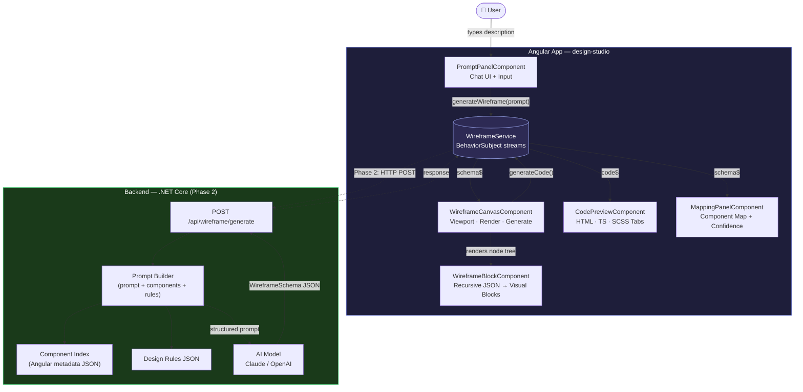
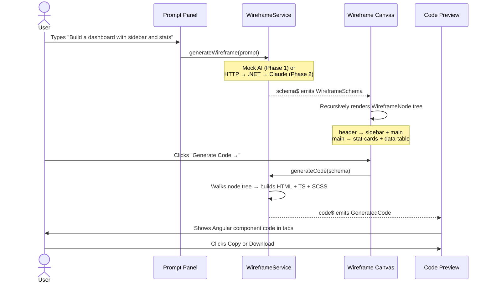
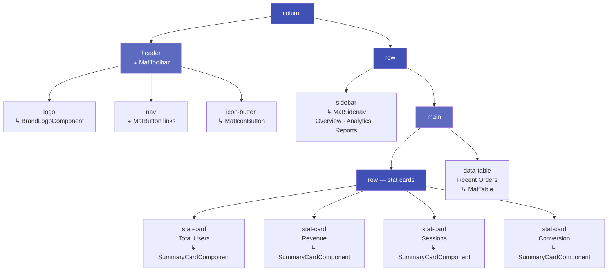

# NLW — Natural Language → Wireframe → Code

An AI-powered UI generation tool. Describe any screen in plain English and get a live interactive wireframe rendered in the browser, then generate production-ready Angular component code in one click.

**Stack:** Angular 19 · Angular Material · Bootstrap 5 · SCSS (no Tailwind, no React)

---

## How to Run

```bash
cd design-studio
npm install
npm start
# Open http://localhost:4200
```

---

## Try These Prompts

- `Create a dashboard with sidebar navigation, stats cards, and a data table`
- `Build a login page with email and password form`
- `Design a landing page with hero section and features grid`
- `Create a multi-step registration form`

---

## Architecture

### 3-Panel Layout

```
┌──────────────────┬─────────────────────┬───────────────────┐
│   PROMPT / CHAT  │  WIREFRAME CANVAS   │   CODE PREVIEW    │
│   (320px)        │  (flexible)         │   (380px)         │
│                  │                     │                   │
│  Chat history    │  Viewport toggle    │  Tabs:            │
│  AI responses    │  (Desktop/Tab/Mob)  │  HTML · TS · SCSS │
│                  │                     │                   │
│  Input + Send    │  Wireframe render   │  Copy · Download  │
│  Example prompts │  Generate Code →    │                   │
│                  │                     │  Component Map    │
└──────────────────┴─────────────────────┴───────────────────┘
```

### Component Structure

```
design-studio/src/app/
├── models/
│   ├── wireframe.model.ts       # WireframeNode, WireframeSchema, GeneratedCode
│   └── chat.model.ts            # ChatMessage, MessageRole
├── services/
│   └── wireframe.service.ts     # AI orchestration, mock data, code generator
└── components/
    ├── prompt-panel/            # Chat UI — user sends prompts, AI replies
    ├── wireframe-canvas/        # Renders WireframeSchema as live browser blocks
    ├── wireframe-block/         # Recursive block renderer (self-referencing)
    ├── code-preview/            # HTML/TS/SCSS tabs with copy + download
    └── mapping-panel/           # Shows wireframe → design system component map
```

### Data Flow

```
User types prompt
      │
      ▼
PromptPanelComponent
      │  calls
      ▼
WireframeService.generateWireframe(prompt)
      │  returns Observable<WireframeSchema>  (mock AI — 1.6s delay)
      │  emits via BehaviorSubject
      ▼
WireframeCanvasComponent  ──subscribes──▶  renders WireframeNode tree
MappingPanelComponent     ──subscribes──▶  shows component mappings

User clicks "Generate Code"
      │
      ▼
WireframeService.generateCode(schema)
      │  walks WireframeNode tree → produces HTML, TS, SCSS strings
      │  emits via BehaviorSubject
      ▼
CodePreviewComponent  ──subscribes──▶  displays in tab group
```

### Wireframe JSON Schema

The AI returns a tree of `WireframeNode` objects. The renderer maps each `type` to a visual block:

```typescript
interface WireframeNode {
  type: WireframeBlockType;   // 'header' | 'sidebar' | 'stat-card' | 'data-table' | ...
  label?: string;
  children?: WireframeNode[]; // recursive — enables nested layouts
  items?: string[];           // sidebar nav items, footer links
  columns?: string[];         // data-table column headers
  value?: string;             // stat-card display value
  mappedComponent?: string;   // e.g. 'MatToolbar', 'SummaryCardComponent'
  width?: string;
  height?: string;
}
```

**Supported block types:**
`header` · `sidebar` · `main` · `footer` · `row` · `column` · `grid` · `card` · `stat-card` · `data-table` · `form` · `hero` · `nav` · `button` · `icon-button` · `input` · `search` · `text` · `image` · `logo` · `tabs` · `stepper` · `divider` · `badge`

---

## How to Implement Real AI (Replace Mock)

The `WireframeService` currently returns hardcoded mock schemas. To connect a real AI model:

### Step 1 — Backend endpoint (.NET Core)

Create `POST /api/wireframe/generate` that accepts `{ prompt: string }` and returns `WireframeSchema`.

**Prompt construction:**

```csharp
var systemPrompt = $"""
  You are a UI wireframe generator. Given a user description, return a JSON object
  matching the WireframeSchema format with a root WireframeNode tree.

  Rules:
  - Use only these block types: header, sidebar, main, footer, row, column, grid,
    card, stat-card, data-table, form, hero, nav, button, icon-button, input,
    search, text, image, logo, tabs, stepper, divider
  - Set mappedComponent to the closest Angular Material or design system component
  - Return ONLY valid JSON, no markdown, no explanation
  - For dashboards: always include header + sidebar + main with stat-cards + data-table
  - For login pages: hero containing a card containing a form
  - For landing pages: header + hero + grid of cards + footer

  Available design system components (exact match):
  {JsonSerializer.Serialize(componentIndex)}

  Design rules:
  {JsonSerializer.Serialize(designRules)}
""";
```

**Key principles:**
- Feed your Angular component metadata as context so AI maps to real components
- Include design system rules (colors, spacing, allowed components) as JSON
- Enforce strict JSON output — no markdown code fences
- Validate the returned JSON against `WireframeNode` schema before sending to frontend

### Step 2 — Component Knowledge Index

Scan your Angular project and extract metadata per component:

```json
[
  {
    "selector": "app-summary-card",
    "inputs": ["title", "value", "trend"],
    "description": "Stats summary card with trend indicator",
    "category": "data-display"
  }
]
```

Store in a JSON file or vector DB. Feed top-N relevant components per prompt using keyword or semantic search.

### Step 3 — Replace mock in Angular service

```typescript
// In WireframeService, replace mockGenerate() call with:
generateWireframe(prompt: string): Observable<WireframeSchema> {
  this._loading$.next(true);
  return this.http.post<WireframeSchema>('/api/wireframe/generate', { prompt }).pipe(
    tap(schema => {
      this._schema$.next(schema);
      this._loading$.next(false);
    }),
    catchError(err => {
      this._loading$.next(false);
      throw err;
    })
  );
}
```

### Step 4 — Streaming (better UX)

Use Server-Sent Events to stream the wireframe JSON token by token and render progressively:

```typescript
const source = new EventSource(`/api/wireframe/stream?prompt=${prompt}`);
source.onmessage = (e) => {
  const partial: WireframeSchema = JSON.parse(e.data);
  this._schema$.next(partial);
};
```

---

## Implementation Phases

### Phase 1 — Foundation ✅
- [x] 3-panel app shell (Chat · Canvas · Code)
- [x] Chat UI with user/AI message bubbles and loading indicator
- [x] Wireframe JSON schema and model types
- [x] Mock AI with 4 pre-built wireframes (Dashboard, Login, Landing, Form)
- [x] Recursive wireframe block renderer (24+ block types)
- [x] Viewport toggle (Desktop / Tablet / Mobile)
- [x] Angular Material + Bootstrap code generation (HTML · TS · SCSS)
- [x] Copy to clipboard and download per file
- [x] Component mapping panel with confidence scores
- [x] Version history dropdown

### Phase 2 — Real AI Integration 🔲
- [ ] .NET Core backend with OpenAI / Claude API endpoint
- [ ] Component knowledge index (scan Angular project → JSON metadata)
- [ ] Design rules JSON (colors, spacing, allowed components)
- [ ] Structured prompt builder (user prompt + components + rules)
- [ ] Replace mock service with real HTTP call (`HttpClient`)
- [ ] Error handling, retry logic, and timeout

### Phase 3 — Design System Awareness 🔲
- [ ] Feed actual company Angular components to AI
- [ ] Exact / partial / fallback confidence scoring per block
- [ ] User can override component mapping manually in the UI
- [ ] Design tokens enforcement in generated SCSS

### Phase 4 — Wireframe Editing 🔲
- [ ] Click any wireframe block to inspect and relabel it
- [ ] Drag to reorder blocks within a container
- [ ] Right-click → "Ask AI to change this element"
- [ ] Undo / redo stack

### Phase 5 — Polish & Export 🔲
- [ ] Named version save ("v1 — initial layout")
- [ ] Version diff view (before / after)
- [ ] Download all files as `.zip`
- [ ] Shareable wireframe link
- [ ] Styled mode toggle (lo-fi wireframe ↔ real Material components preview)
- [ ] "Generate 3 layout variants" multi-output support
- [ ] Streaming wireframe generation via SSE

---

## System Architecture Diagram



---

## UI Flow Diagram



---

## Wireframe Node Tree — Dashboard Example


